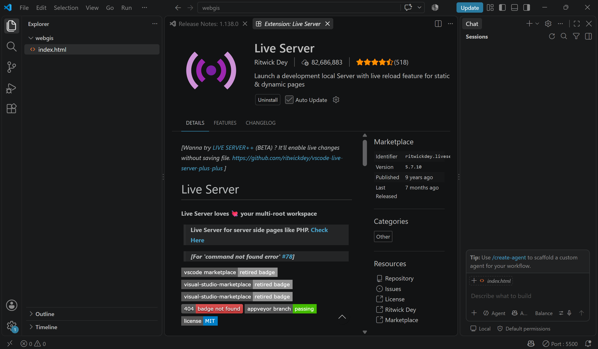
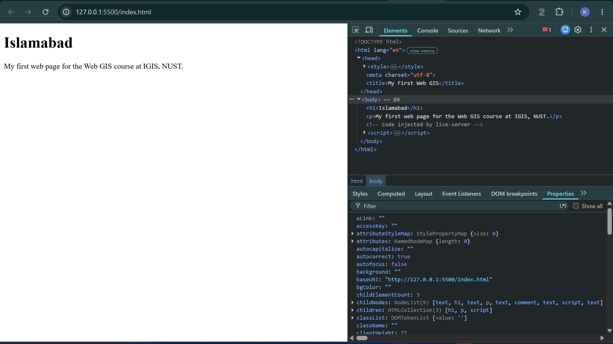
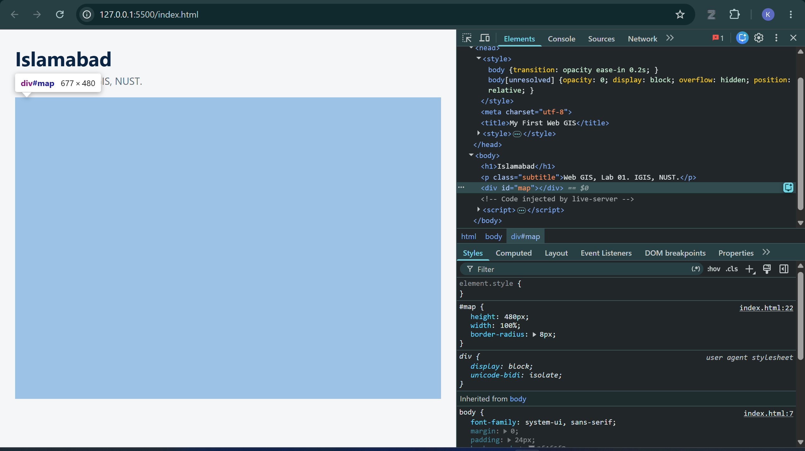
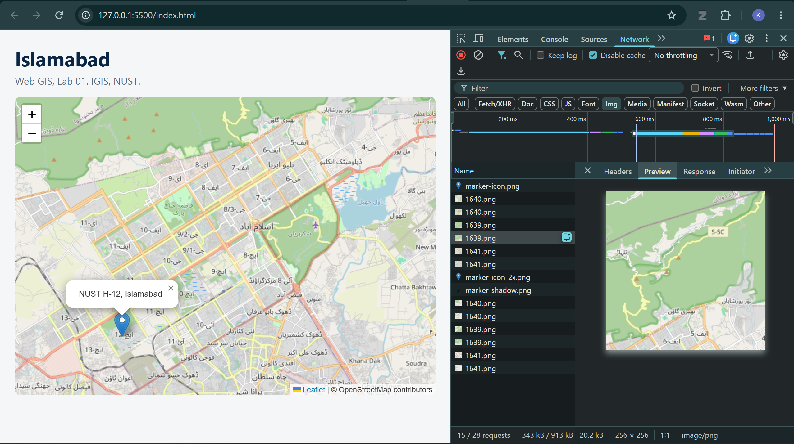
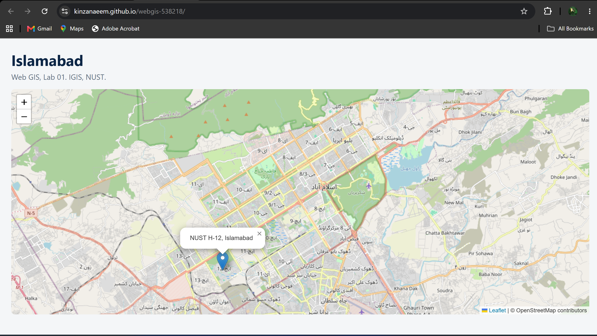

# Lab 01: Your First Web Map

**Course:** Web GIS, IGIS, NUST
**Name:** Kinza Naeem
**Roll No:** 538218

**Repository:** https://github.com/Kinzanaeem/webgis-538218
**Live site:** https://kinzanaeem.github.io/webgis-538218/

---

## Checkpoints

### Checkpoint 1: Tools set up
VS Code with the `C:\webgis` project folder open in the Explorer panel and the Live Server extension (Ritwick Dey) installed.

### Checkpoint 2: First web page through Live Server
The first page opened through Live Server at `127.0.0.1:5500`, with Developer Tools open on the Elements tab.

### Checkpoint 3: CSS rules for the map container
The styled heading and subtitle, with the `div#map` element selected in the Elements panel and its `#map` rule (height 480px, width 100%, border-radius 8px) visible in the Styles panel.

### Checkpoint 4: Tile requests in the Network tab
The working Leaflet map of Islamabad with the NUST H-12 marker. The Network tab lists the tile requests, and tile `1639.png` is selected with its Preview showing a 256 × 256 image/png tile.

### Checkpoint 5: Live GitHub Pages site
The same map served from GitHub Pages at the public `github.io` address.

It is now deployed and visible.
---

## Questions

### 1. In Part 2 your page made one network request. After Part 4 it made dozens. Explain what changed and why.

In Part 2 the page was a single HTML file with no external resources, so the browser only requested `index.html`. After Part 4, the page loads the Leaflet library (its CSS and JavaScript files from unpkg), the marker icon images, and the background map itself, which is not one picture but many 256 × 256 PNG tiles requested from the OpenStreetMap tile server. Each tile URL contains the zoom level, column and row, for example `12/2878/1639.png`. On reload my page made 28 requests, 15 of them images, and panning the map produced new tile requests as more of the map came into view.

### 2. What is the difference between what HTML does and what CSS does? Give one example of each from your own file.

HTML defines what exists on the page: its content and structure. For example, `

` creates the container that the map is drawn into, and `<h1>Islamabad</h1>` creates the heading. CSS defines how those elements look: size, colour, spacing and fonts. For example, `#map { height: 480px; width: 100%; border-radius: 8px; }` gives the map container its size and rounded corners, and `.subtitle { color: #5a6b7b; }` makes the subtitle grey.

### 3. Why does the #map rule need a height, when the h1 rule does not?

The `h1` contains text, so the browser works out its height automatically from its content. The map `div` is empty when the page loads, and an empty `div` has a height of zero by default. Leaflet draws the map inside this box, so without an explicit height the map is drawn into a box zero pixels tall and nothing appears, with no error in the console. When I changed the height to `0px` in the Styles panel, the map area disappeared completely.

### 4. You opened your page through Live Server at 127.0.0.1 instead of double-clicking the file. Give one reason this matters.

Live Server runs a real web server on my machine, so the page is loaded over `http://` the same way it will be on GitHub Pages. If the file is opened directly (`file:///...`), the browser blocks the page from requesting other files such as GeoJSON data, as a security measure. From week 2, map data would silently fail to load. Using Live Server means the page behaves the same locally as it does online, and it also reloads automatically when I save.

### 5. A classmate's marker appears in the sea near Africa instead of in Islamabad. What is almost certainly wrong, and how would you fix it?

The latitude and longitude have almost certainly been swapped. Leaflet expects coordinates as `[latitude, longitude]`, but GeoJSON and many other sources write them as `[longitude, latitude]`, so it is easy to paste them in the wrong order. The fix is to reverse the two numbers, for example changing `[72.9906, 33.6423]` to `[33.6423, 72.9906]` for the NUST campus.
